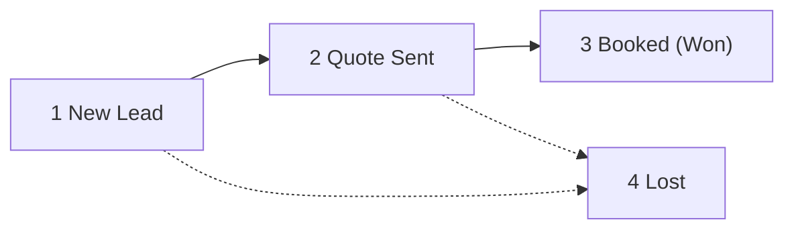

# EasyRideCebu Admin Portal — Funnel Stages & Workflows

> **Who this is for:** anyone working leads in `/admin`. It explains the two
> controls you'll touch most — the **funnel stage bar** and the **automations
> panel** — what they mean, how to drive them, and what happens behind the scenes.
>
> For the system design and schema, see
> [CRM_FUNNEL_IMPLEMENTATION_PLAN.md](./CRM_FUNNEL_IMPLEMENTATION_PLAN.md).

- **Applies to:** `/admin/inquiries/[id]` (the per-inquiry workflow screen)
- **Last updated:** 2026-07-28

---

## Table of Contents

1. [Reading the funnel stage bar](#1-reading-the-funnel-stage-bar)
2. [What each stage means](#2-what-each-stage-means)
3. [Two things that surprise people](#3-two-things-that-surprise-people)
4. [How to move a lead to the next stage](#4-how-to-move-a-lead-to-the-next-stage)
5. [What happens when you click a stage](#5-what-happens-when-you-click-a-stage)
6. [The automations (W1–W5)](#6-the-automations-w1w5)
7. [Why a workflow is missing from the dropdown](#7-why-a-workflow-is-missing-from-the-dropdown)
8. [When to start an automation manually](#8-when-to-start-an-automation-manually)
9. [Controlling a running automation](#9-controlling-a-running-automation)
10. [Troubleshooting](#10-troubleshooting)
11. [Quotes: the checkout page](#12-quotes-the-checkout-page)
12. [Payments: checking the money arrived](#13-payments-checking-the-money-arrived)
13. [File map](#11-file-map)

---

## 1. Reading the funnel stage bar

```
FUNNEL STAGE                                    Click a stage to move this lead

  ✓ ─────────── ❷ ─────────── ③ ─────────── ④
New Lead     Quote Sent    Booked (Won)     Lost
               ▲ current
```

Three visual states, and nothing else to learn:

| What you see | Meaning |
|---|---|
| **✓ red ring, red label** | Already passed through |
| **Solid red circle, bold black label** | Where the lead is **right now** |
| **Grey circle, grey label** | Not reached yet |

The connector bars behind the current stage are red; the ones ahead stay grey.

---

## 2. What each stage means

| # | Stage (`key`) | Meaning | Probability | Normally entered by |
|---|---|---|---|---|
| 1 | **New Lead** (`new_lead`) | Form submitted, nobody has closed it yet | 10% | Automatic on intake |
| 2 | **Quote Sent** (`quote_sent`) | A priced quote link is with the customer | 50% | Automatic when you send a quote |
| 3 | **Booked (Won)** (`booked`) | Customer confirmed and chose how to pay | 100% | The customer accepting their quote, or you |
| 4 | **Lost** (`lost`) | Didn't convert (reason recorded) | 0% | You, the customer declining, or a W2/W3 timeout |

> **Why only four?** Every stage has to earn its place, because a stage nobody
> updates is worse than none — it makes the funnel report lie. Reaching out and
> haggling are *activities* on the timeline, not positions in the funnel, and a
> finished trip is a won deal whose date has passed.

### The probability column is doing real work

The dashboard's **weighted forecast** is:

```
Σ (deal value × stage probability)
```

A ₱20,000 deal at New Lead contributes **₱2,000** to the forecast. Send the quote
and it jumps to **₱10,000**. That's how you forecast revenue without guessing.

> ⚠️ **A deal with a value of ₱0 contributes nothing to the forecast, at any
> stage.** Sending a quote sets the deal value automatically from the total of
> its live quotes, so in practice this only bites leads you never quoted.

Stages live in the `pipeline_stages` table as rows, not as a hard-coded enum, so
they can be renamed or reordered later without a migration.

---

## 3. Two things that surprise people

### Lost is #4, but it is **not** "after Booked"

The numbering makes Lost look like the end of the road. It isn't — it's a **side
exit**. A lead can drop to Lost from any earlier stage.



The code special-cases this so reports don't lie
(`src/lib/workflows/engine.ts`):

```ts
// "Lost" sorts last but is terminal, not "further along" — treat it separately.
if (stageKey === 'lost') return condition.stage === 'lost';
return stageRank(stageKey) >= stageRank(condition.stage);
```

Without that guard, a lead lost at New Lead would count as having passed through
Booked (since `4 > 3`) and every conversion rate on the dashboard would be
inflated.

### Won / Lost status is derived — you never type it in

`pipeline_stages` carries `is_won` and `is_lost` flags. Moving a lead is a single
action; `moveStage()` works out the rest:

```ts
const status = toStage.isWon ? 'won' : toStage.isLost ? 'lost' : 'open';
```

It also stamps `won_at` / `lost_at` and refreshes the contact's lifetime value.

---

## 4. How to move a lead to the next stage

**Three ways. All of them hit the same endpoint, so they behave identically.**

| Where | How |
|---|---|
| **Lead detail** — the stage bar | Click any circle. The current stage is disabled; everything else is clickable. |
| **Lead detail** — top-right buttons | **Mark Won** → Booked · **Mark Lost** → Lost |
| **Lead detail** — the Quote panel | **Sending a quote** moves the lead to Quote Sent automatically |
| **`/admin/pipeline`** — kanban board | Drag a card into another column |
| **The customer** | Accepting their quote → Booked · declining it → Lost |

The last two matter: **Quote Sent and Booked mostly move themselves.** You send a
quote and the customer decides — see [§12](#12-quotes-the-checkout-page).

### Moving backward is allowed

Nothing blocks Quote Sent → New Lead. Correcting a misclick is normal, and the
timeline records **both** moves, so the history stays honest.

### Moving to Lost asks you why

A prompt appears asking for the reason.

- **Cancel** aborts the move entirely — nothing changes.
- **Leaving it blank** records `"No reason given"`.

Those reasons roll up into the dashboard's **"Why deals died"** panel. That is
the entire point of the prompt — a funnel that can't tell you *why* it leaks
can't be fixed.

---

## 5. What happens when you click a stage

One click sets off a short chain. It is never *just* a label change.

```
Click a stage
  │
  ├─► PATCH /api/admin/opportunities/[id]   { stageKey }
  │
  └─► moveStage()
        1. Update stage_id, status, won_at / lost_at, stage_changed_at
        2. Write a stage_change row to the timeline (with your name on it)
        3. applyExitConditions()  — retire automations this move made pointless
        4. handleStageChanged()   — start automations this new stage triggers
        5. If the new stage is Booked → check for a pending referral, fire W5
  │
  └─► recalculateLifetimeValue()  — refresh the contact's lifetime value
```

**Steps 3 and 4 are the important ones.** Moving a lead to Quote Sent will:

- **exit W2** (the chase-them drip — pointless now a quote is out), and
- **start W3** (the quote → booking sequence).

You didn't ask for either. That's the system doing its job.

---

## 6. The automations (W1–W5)

| | Name | Fires automatically when | What it does |
|---|---|---|---|
| **W1** | Instant Lead Capture & Response | Any of the 3 site forms is submitted | Auto-reply to the customer, alert the team, create a *"call back within 15 min"* task, tag the contact, hand off to W2 |
| **W2** | Speed-to-Lead Follow-Up | Immediately after W1 | Chases a silent lead at **1h**, **24h**, **72h**, then marks it Lost *(no response)*. Exits the moment you log a reply or the deal reaches Quote Sent |
| **W3** | Quote → Booking Conversion | Stage → **Quote Sent** (i.e. when you send a quote) | Emails the quote link, waits a day, nudges, waits two more days, then concedes to Lost *(went cold)* |
| **W4** | Fulfillment, Review & Re-Engagement | Stage → **Booked** | Confirmation, driver task, day-before reminder, then a few hours after the trip asks for a review, invites happy customers to refer, re-engages at 30 and 90 days |
| **W5** | Referral Reward | A referred friend's deal reaches **Booked** | Runs the anti-abuse guardrails, assigns both rewards, asks you to approve the payout |

Each enrollment card shows a progress bar, the current step, **what fires next**
and **when** — e.g. *"Step 3 of 10 · next: Check: won · in a day"*.

---

## 7. Why a workflow is missing from the dropdown

The **"Start an automation manually"** list hides any workflow that is **already
running on this lead**:

```ts
// src/components/admin/AutomationsPanel.tsx
const available = WORKFLOW_DEFINITIONS.filter((d) => !enrolledKeys.has(d.key));
```

`enrolledKeys` covers enrollments with status **`active`** or **`paused`**.

**Worked example.** A lead sitting at Quote Sent shows only:

```
W1 · Instant Lead Capture & Response
W2 · Speed-to-Lead Follow-Up
W4 · Fulfillment, Review & Re-Engagement
W5 · Referral Reward
```

**W3 is absent** — because moving the lead to Quote Sent started it, and it's
currently parked mid-sequence waiting out a timer. Hiding it prevents a
double-enrollment that would send the customer two quote emails.

Move the lead to Booked or Lost, W3 exits, and it reappears in the list.

---

## 8. When to start an automation manually

**Most of the time you won't need this dropdown.** W1 fires on intake; W3 and W4
fire on stage changes. It exists for the exceptions:

| Situation | Enrol |
|---|---|
| Lead arrived by phone or Messenger and you created it by hand, so W1 never ran | **W1** — sends the acknowledgement, creates the callback task |
| A cold lead resurfaced months later and you want them back in the chase sequence | **W2** |
| The post-trip review request bounced, or you want to re-invite a repeat customer | **W4** |
| Testing the system | any |

Manual enrollment starts at **step 0** and runs immediately. It's written to the
timeline as *"Manually enrolled in w1_intake"* **with your name on it**, so a
colleague can always tell a human started it rather than the system.

---

## 9. Controlling a running automation

Each live enrollment card has three buttons:

| Button | Effect | Use when |
|---|---|---|
| ⏸ **Pause** | Freezes the sequence, keeping its position | You want to handle this lead personally without losing the sequence |
| ▶ **Resume** | Picks up exactly where it stopped | You're done, let the robot carry on |
| ✕ **Stop** | Ends it permanently — no restart | The drip is actively wrong for this customer |

### The quieter control: "Log a reply"

In the **Activity timeline** panel there's a **Log a reply** button. It writes an
inbound-message activity — which is exactly what W2's *"Replied?"* check looks
for.

**So logging a reply makes the follow-up drip stand down without you touching the
automations panel at all.** That's the intended way to tell the system *"this
customer answered me on WhatsApp."* Same for **Log a call**.

---

## 10. Troubleshooting

**"I moved a lead and an automation started on its own."**
Working as designed — see [§5](#5-what-happens-when-you-click-a-stage). Quote
Sent starts W3; Booked starts W4.

**"A workflow vanished from the manual dropdown."**
It's already running on this lead. See [§7](#7-why-a-workflow-is-missing-from-the-dropdown).

**"The customer replied but the drip keeps messaging them."**
Log the reply (**Log a reply** in the timeline) or advance the stage. W2 has no
other way to know they answered.

**"My weighted forecast is ₱0 even though I have open deals."**
Those deals have a value of ₱0. Set it in *Inquiry details* → **Deal value**.

**"An automation shows 'not sent' on the timeline."**
No messaging provider is configured for that channel. Email needs
`RESEND_API_KEY`; WhatsApp steps deliberately produce a **one-tap wa.me link** on
the timeline for an agent to send, rather than sending automatically.

**"An automation is still 'active' but the deal is already won."**
It will exit on its next scheduled run. Stage changes also trigger an immediate
re-check (`applyExitConditions`), so this should be rare — hit ✕ **Stop** if you
want it gone now.

**"Nothing is progressing on a timed step."**
Timed steps are driven by the cron runner. On Vercel it's scheduled in
`vercel.json` (every 5 minutes). Locally, nothing calls it automatically — fire
it by hand:

```bash
curl -H "Authorization: Bearer $CRON_SECRET" http://localhost:3000/api/cron/workflows
```

---

## 12. Quotes: the checkout page

**Yes — a quote is a checkout page.** You build the price in the portal, the
system generates a private link, and the customer opens it to see exactly what
they're paying for, how to pay, and a button that confirms the booking.

### Sending one

On the lead detail screen, open the **Quote** panel → **Build a quote**:

1. Add line items (label, optional detail, qty × unit price)
2. Optionally set a **discount** and a **deposit** to hold the booking
3. Set how long the price is held — **7 days** by default
4. Add notes the customer will see (inclusions, pickup point, terms)
5. **Send quote**

That single action:

- creates the quote and its private link,
- sets the deal value to the total of every live quote (so your forecast is right),
- moves the lead to **Quote Sent**, and
- starts **W3**, which emails the link and chases if they go quiet.

### A second quote: replace, or split the payment

When a quote is still awaiting payment, building another one asks you which you
mean:

| Choice | Use it for | What happens |
|---|---|---|
| **Replace it** *(default)* | A corrected price | The earlier quote is cancelled and its link stops working — a customer can never be looking at two competing prices for the same trip |
| **Add a payment** | A deposit now and the balance later, or a trip split across instalments | Both links stay live, and the deal value becomes the **sum** of them |

With a split payment the customer pays each link separately, and **each payment
sends its own confirmation**: the first says what's left to settle (with the
link to settle it), the last says the booking is paid in full. Your team gets an
alert per payment, labelled *Part-payment* or *Final payment*.

Turning down the balance on a booking that is already part-paid does **not**
mark the deal Lost — the decline is logged for you to chase.

### What the customer sees at `/quote/[token]`

| Section | Contents |
|---|---|
| Header | Total, service, trip date, quote reference, **how many days the price is held** |
| What's included | Every line item with its amount, then subtotal → discount → total |
| How would you like to pay? | GCash · BPI · Cash on pickup — pick one to reveal the details |
| Payment details | **Scannable QR**, a **Save QR** button, account name/number, and a reference-number field |
| Confirm | **Confirm my booking** · *Ask a question first* (WhatsApp) · *No thanks* |

**The Save QR button** hands the image to the phone's share sheet so it lands in
Photos — which is what a customer needs, because they have to leave your page to
open GCash and scan. On desktop it downloads normally.

### The link expires

The token is unguessable and scoped to one deal, which is why the customer never
logs in. It stops working after the validity window:

- the page shows **"This quote has expired"** with a WhatsApp button, and
- the accept endpoint refuses with **410 Gone** — an expired price can't be
  claimed even by replaying the request.

The cron runner also sweeps lapsed quotes to `expired` so the portal and the
customer's page always agree.

### When the customer decides

| They tap | What happens |
|---|---|
| **Confirm my booking** | Quote → `accepted` (payment method + reference recorded) · lead → **Booked** · deal value re-summed from the live quotes · **W4 starts** · the customer is emailed their receipt · your team gets a "Booking confirmed" alert |
| **No thanks** | Quote → `declined` with their reason · lead → **Lost**, reason recorded for the "Why deals died" report — unless another quote on the deal is already paid |

Accepting twice is treated as a double-tap, not an error.

**The two emails on payment.** The customer's receipt repeats every number they
saw at checkout — reference, trip, amount, payment method, their own reference
number — so it's the thing they screenshot at the pickup point. The team's alert
carries the same figures plus a reminder that a transfer reference is what the
customer *typed*, not a verified receipt: check the money landed before you
commit a vehicle. Both are sent even if the W4 automation is switched off, and a
failure to send can never fail the booking.

### Adding your payment QR codes

Edit **`src/data/payment-methods.ts`** and paste each image URL into
`qrImageUrl`. Until you do, that method still works — the page just shows the
account details with a "QR coming soon" placeholder instead of a scan panel.

```ts
{
  key: 'gcash',
  accountNumber: '0917 804 6988',
  qrImageUrl: 'https://…public.blob.vercel-storage.com/easyride/gcash.png',
  …
}
```

---

## 13. Payments: checking the money arrived

Nothing in this system talks to your bank. When a customer taps **Confirm my
booking** they are *claiming* they paid — so every confirmation files a payment
record for a human to check, and **`/admin/payments`** is that queue.

### What the customer sends

Under the account details on the quote page, GCash and BPI customers get two
ways to evidence the transfer:

- the **reference number** from their receipt, and
- a **screenshot** of the payment — picked from their phone, downscaled and
  re-encoded in the browser so a 12 MP photo still uploads on a Cebu 4G signal.

They must supply **at least one of the two** before the confirm button unlocks.
Cash on pickup asks for neither — there is no money yet.

### Working the queue

| Screen | What it gives you |
|---|---|
| **`/admin/payments`** | Every payment, newest first. Filter to **Needs checking** to see only what nobody has looked at. Each row shows the amount, method, customer, quote reference and whether a screenshot came with it |
| **`/admin/payments/[id]`** | The screenshot full-size, the customer's reference number, and the lead it belongs to — service, trip date, stage, phone, email, quote total, and what has been verified so far. Buttons to open the lead, view the quote, or call |

Open your GCash or bank app, find the transfer, then hit **Verify** (or
**Reject**, with a note). Either way the decision is written to the lead's
timeline, so whoever picks up the phone next can see it.

> A payment being *verified* does not move the deal — the booking was already
> confirmed when the customer accepted the quote. Verifying is bookkeeping:
> it's how you know a vehicle can be committed.

### Where the screenshots live

In the database, served through `/api/admin/payments/[id]/proof`, which refuses
anyone without an admin session. They are screenshots of people's banking apps,
so they deliberately do **not** get a public URL. Uploads are capped at 4 MB and
the file type is checked by reading the image's magic bytes, never the
browser-supplied content type.

---

## 11. File map

| Concern | File |
|---|---|
| Stage definitions, order, probabilities | `src/lib/funnel/stages.ts` |
| The stage bar component | `src/components/admin/StageStepper.tsx` |
| Stage-click handler, Won/Lost buttons | `src/app/admin/inquiries/[id]/page.tsx` |
| Kanban drag-and-drop | `src/app/admin/pipeline/page.tsx` |
| `moveStage()` + exit/trigger chain | `src/lib/workflows/engine.ts` |
| Stage-change endpoint | `src/app/api/admin/opportunities/[id]/route.ts` |
| W1–W5 definitions | `src/lib/workflows/definitions.ts` |
| Automations panel + dropdown filter | `src/components/admin/AutomationsPanel.tsx` |
| Pause / resume / stop endpoint | `src/app/api/admin/enrollments/[id]/pause/route.ts` |
| Cron runner | `src/app/api/cron/workflows/route.ts` |
| Message copy | `src/lib/messaging/templates.ts` |
| Quote lifecycle (create / accept / expire) | `src/lib/crm/quotes.ts` |
| Customer checkout page | `src/app/quote/[token]/page.tsx` |
| Quote builder panel | `src/components/admin/QuoteBuilder.tsx` |
| **Payment methods + QR URLs** | `src/data/payment-methods.ts` |
| Payment records, proof storage, review | `src/lib/crm/payments.ts` |
| Customer's screenshot upload field | `src/components/quote/ProofOfPaymentField.tsx` |
| In-browser image downscale / re-encode | `src/lib/image-to-webp.ts` |
| Image type sniffing (magic bytes) | `src/lib/image-mime.ts` |
| Payments queue + detail screens | `src/app/admin/payments/` |
| Proof image endpoint (admin only) | `src/app/api/admin/payments/[id]/proof/route.ts` |
| QR save button (mobile share sheet) | `src/components/ui/DownloadQRButton.tsx` |
